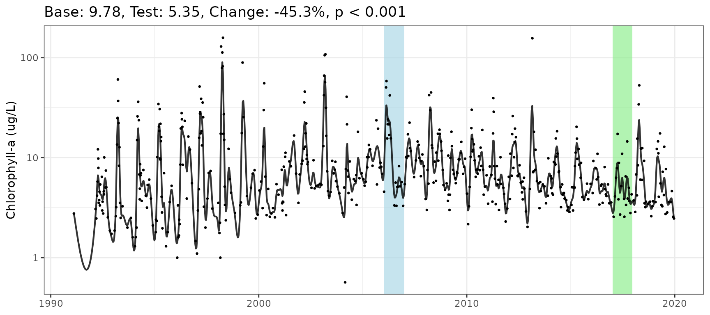
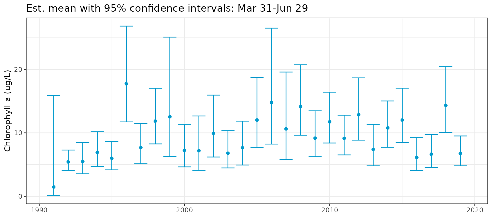
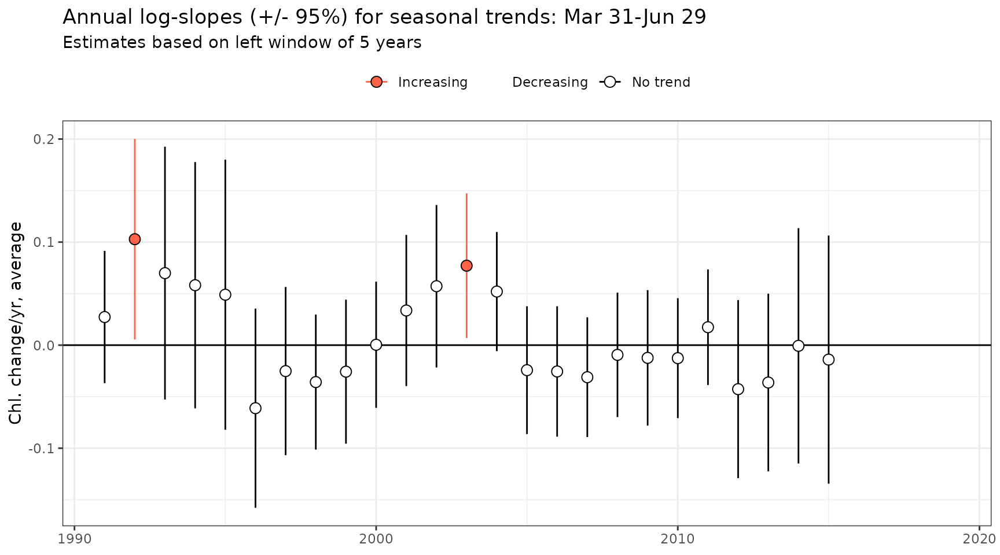
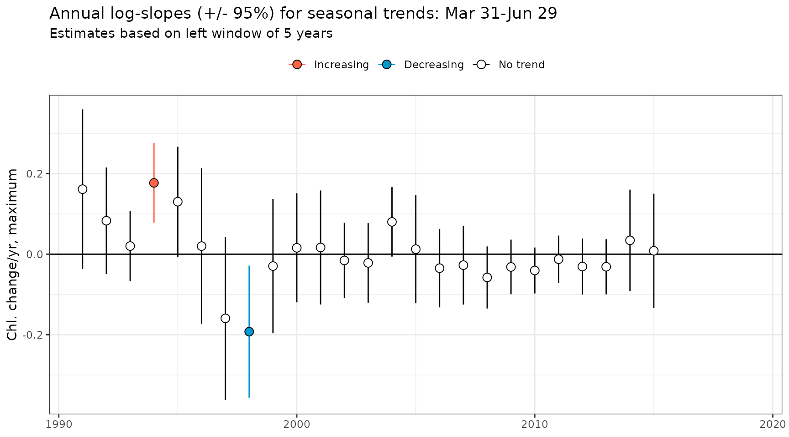
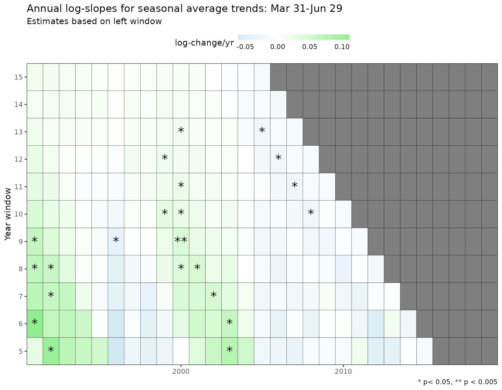

# Getting started

This package can be used to assess water quality trends for long-term
monitoring data in estuaries using Generalized Additive Models and
mixed-effects meta-analysis (Wood 2017; Sera et al. 2019). These models
are appropriate for data typically from surface water quality monitoring
programs at roughly monthly or biweekly collection intervals, covering
at least a decade of observations (e.g., Cloern and Schraga 2016). Daily
or continuous monitoring data covering many years are not appropriate
for these methods, due to computational limitations and a goal of the
analysis to estimate long-term, continuous trends from irregular or
discontinuous sampling.

## Basic usage

The sample dataset `rawdat` is included in the package and is used for
the examples below. This dataset includes monthly time series data over
~30 years for nine stations in South Bay, San Francisco Estuary. Data
are available for 4 water quality parameters. All data are in long
format with one observation per row.

The data are pre-processed to work with the GAM fitting functions
included in this package. The columns include date, station number,
parameter name, and value for the date. Additional date columns are
included that describe the day of year (`doy`), date in decimal time
(`cont_year`), year (`yr`), and month (`mo` as character label). These
are required for model fitting or use with the analysis/plotting
functions.

``` r
head(rawdat)
```

    #>         date station param     value doy cont_year   yr  mo
    #> 1 1990-02-27      18   chl 1.0333333  58  1990.156 1990 Feb
    #> 2 1990-04-18      18   chl 1.6333333 108  1990.293 1990 Apr
    #> 3 1990-05-30      18   chl 1.6000000 150  1990.408 1990 May
    #> 4 1990-07-30      18   chl 5.2333333 211  1990.575 1990 Jul
    #> 5 1990-12-06      18   chl 0.9333333 340  1990.929 1990 Dec
    #> 6 1991-02-06      18   chl 1.6333333  37  1991.099 1991 Feb

One GAM model can be fit to the time series data. Each GAM fits additive
smoothing functions to describe variation of the response variable
(`value`) over time, where time is measured as a continuous number. The
basic GAM used by this package is as follows:

- `S`: value ~ s(year, k = *large*)

The `cont_year` vector is measured as a continuous numeric variable for
the annual effect (e.g., January 1st, 2000 is 2000.0, July 1st, 2000 is
2000.5, etc.). The function `s()` models `cont_year` as a smoothed,
non-linear variable. The optimal amount of smoothing on `cont_year` is
determined by cross-validation as implemented in the mgcv package (Wood
2017) and an upper theoretical upper limit on the number of knots for
`k` should be large enough to allow sufficient flexibility in the
smoothing term. The upper limit of `k` was chosen as 12 times the number
of years for the input data. If insufficient data are available to fit a
model with the specified `k`, the number of knots is decreased until the
data can be modelled, e.g., 11 times the number of years, 10 times the
number of years, etc.

The
[`anlz_gam()`](https://tbep-tech.github.io/wqtrends/reference/anlz_gam.md)
function is used to fit the model. First, the raw data are filtered to
select only station 34 and the chlorophyll parameter. The model is fit
using a log-10 transformation of the response variable. Available
transformation options are log-10 (`log10`) or identity (`ident`). The
log-10 transformation is used by default if not specified by the user.

``` r
tomod <- rawdat %>%
 filter(station %in% 34) %>%
 filter(param %in% "chl")
mod <- anlz_gam(tomod, trans = "log10")
mod
```

    #> 
    #> Family: gaussian 
    #> Link function: identity 
    #> 
    #> Formula:
    #> value ~ s(cont_year, k = 348)
    #> 
    #> Estimated degrees of freedom:
    #> 219  total = 219.93 
    #> 
    #> GCV score: 0.07280572

All remaining functions use the model results to assess fit, calculate
seasonal metrics and trends, and plot results.

The fit can be assessed using
[`anlz_smooth()`](https://tbep-tech.github.io/wqtrends/reference/anlz_smooth.md)
and
[`anlz_fit()`](https://tbep-tech.github.io/wqtrends/reference/anlz_fit.md),
where the former assesses the individual smoother functions and the
latter assesses overall fit. The
[`anlz_smooth()`](https://tbep-tech.github.io/wqtrends/reference/anlz_smooth.md)
results show the results for the fit to the `cont_year` smoother as the
effective degrees of freedom (`edf`), the reference degrees of freedom
(`Ref.df`), the test statistic (`F`), and statistical significance
(`p-value`). The significance is in part based on the difference between
`edf` and `Ref.df`. The
[`anlz_fit()`](https://tbep-tech.github.io/wqtrends/reference/anlz_fit.md)
results show the overall summary of the model as Akaike Information
Criterion (`AIC`), the generalized cross-validation score (`GCV`), and
the `R2` values. Lower values for `AIC` and `GCV` and higher values for
`R2` indicate better model fit.

``` r
anlz_smooth(mod)
```

    #>       smoother      edf   Ref.df        F p.value
    #> 1 s(cont_year) 218.9304 262.4483 4.788546       0

``` r
anlz_fit(mod)
```

    #>             AIC        GCV        R2
    #> GCV.Cp -3.16689 0.07280572 0.6842621

The plotting functions show the results in different formats. If
appropriate for the response variable, the model predictions are
back-transformed and the scales on each plot are shown in log10-scale to
preserve the values of the results.

The
[`show_prddoy()`](https://tbep-tech.github.io/wqtrends/reference/show_prddoy.md)
function shows estimated results by day of year with separate lines for
each year.

``` r
ylab <- "Chlorophyll-a"
show_prddoy(mod, ylab = ylab)
```


The
[`show_prdseries()`](https://tbep-tech.github.io/wqtrends/reference/show_prdseries.md)
function shows predictions for the model across the entire time series.
Points are the observed data and the lines are the predicted.

``` r
show_prdseries(mod, ylab = ylab)
```


The
[`show_prdseason()`](https://tbep-tech.github.io/wqtrends/reference/show_prdseason.md)
function is similar except that the model predictions are grouped by
month. This provides a simple visual depiction of changes by month over
time. The trend analysis functions below can be used to statistically
test the seasonal changes.

``` r
show_prdseason(mod, ylab = ylab)
```


Finally, the
[`show_prd3d()`](https://tbep-tech.github.io/wqtrends/reference/show_prd3d.md)
function shows a three-dimensional fit of the estimated trends across
year and day of year with the z-axis showing the estimates for the
response variable.

``` r
show_prd3d(mod, ylab = ylab)
```

## Trend testing

Statistical tests for evaluating trends are available in this package.
These methods are considered “secondary” analyses that use results from
a fitted GAM to evaluate trends or changes over time. In particular,
significance of changes over time are evaluated using mixed-effect
meta-analysis (Sera et al. 2019) applied to the GAM results to allow for
full propagation of uncertainty between methods. Each test includes a
plotting method to view the results.

### Evaluating changes between time periods

The
[`anlz_perchg()`](https://tbep-tech.github.io/wqtrends/reference/anlz_perchg.md)
and
[`show_perchg()`](https://tbep-tech.github.io/wqtrends/reference/show_perchg.md)
functions can be used to compare annual averages between two time
periods of interest. The functions require base and test year inputs
that are used for comparison. More than one year can be entered for the
base and test years, e.g., `baseyr = c(1990, 1992, 1993)`
vs. `testyr = c(2014, 2015, 2016)`.

``` r
anlz_perchg(mod, baseyr = 2006, testyr = 2017)
```

    #> # A tibble: 1 × 4
    #>   baseval testval perchg     pval
    #>     <dbl>   <dbl>  <dbl>    <dbl>
    #> 1    9.78    5.35  -45.3 0.000376

To plot the results for one GAM, use the
[`show_perchg()`](https://tbep-tech.github.io/wqtrends/reference/show_perchg.md)
function. The plot title summarizes the results.

``` r
show_perchg(mod, baseyr = 2006, testyr = 2017, ylab = "Chlorophyll-a (ug/L)")
```



### Evaluating seasonal changes over time

The
[`anlz_metseason()`](https://tbep-tech.github.io/wqtrends/reference/anlz_metseason.md),
[`anlz_mixmeta()`](https://tbep-tech.github.io/wqtrends/reference/anlz_mixmeta.md),
and
[`show_metseason()`](https://tbep-tech.github.io/wqtrends/reference/show_metseason.md)
functions evaluate seasonal metrics (e.g., mean, max, etc.) between
years, including an assessment of the trend for selected years using
mixed-effects meta-analysis modelling. These functions require inputs
for the seasonal ranges to evaluate (`doyend`, `doystr`) and years for
assessing the trend in the seasonal averages/metrics (`yrstr`, `yrend`).

The
[`anlz_metseason()`](https://tbep-tech.github.io/wqtrends/reference/anlz_metseason.md)
function estimates the seasonal metrics (including uncertainty as
standard error) for results from the GAM fit. The seasonal metric can be
any summary function available in R, such as seasonal maxima (`max`),
minima (`min`), variance (`var`), or others. The function uses repeated
resampling of the GAM model coefficients to simulate multiple time
series as an estimate of uncertainty for the summary parameter.

The inputs for
[`anlz_metseason()`](https://tbep-tech.github.io/wqtrends/reference/anlz_metseason.md)
include the seasonal range as day of year using start (`doystr`) and end
(`doyend`) days and the `metfun` and `nsim` arguments to specify the
summary function and number of simulations, respectively. Here we show
the estimate for the maximum chlorophyll in each season, using a
relatively low number of simulations. Repeating this function will
produce similar but slightly different results because the estimates are
stochastic. In practice, a large value for `nsim` should be used to
produce accurate results (e.g., `nsim = 1e5`).

``` r
metseason <- anlz_metseason(mod, metfun = max, doystr = 90, doyend = 180, nsim = 100)
metseason
```

    #> # A tibble: 29 × 7
    #>       yr   met     se bt_lwr bt_upr bt_met dispersion
    #>    <dbl> <dbl>  <dbl>  <dbl>  <dbl>  <dbl>      <dbl>
    #>  1  1991 0.264 0.426   0.301   14.1   2.06     0.0434
    #>  2  1992 0.825 0.0676  5.52    10.2   7.49     0.0434
    #>  3  1993 1.41  0.102  18.1     45.5  28.7      0.0434
    #>  4  1994 1.12  0.0900  9.76    22.0  14.6      0.0434
    #>  5  1995 1.27  0.0845 14.4     30.8  21.0      0.0434
    #>  6  1996 1.31  0.108  13.9     37.0  22.7      0.0434
    #>  7  1997 1.41  0.0998 18.2     44.9  28.6      0.0434
    #>  8  1998 1.96  0.104  63.3    162.  101.       0.0434
    #>  9  1999 1.58  0.138  22.8     79.4  42.5      0.0434
    #> 10  2000 1.32  0.122  13.4     40.3  23.3      0.0434
    #> # ℹ 19 more rows

The
[`anlz_mixmeta()`](https://tbep-tech.github.io/wqtrends/reference/anlz_mixmeta.md)
function uses results from the
[`anlz_metseason()`](https://tbep-tech.github.io/wqtrends/reference/anlz_metseason.md)
to estimate the trend in the seasonal metric over a selected year range.
Here, we evaluate the seasonal trend from 2006 to 2017 for the seasonal
estimate of the model results above.

``` r
anlz_mixmeta(metseason, yrstr = 2006, yrend = 2017)
```

    #> Call:  mixmeta::mixmeta(formula = met ~ yr, S = S, data = totrnd, random = ~1 | 
    #>     yr, method = "reml")
    #> 
    #> Fixed-effects coefficients:
    #> (Intercept)           yr  
    #>     69.0944      -0.0338  
    #> 
    #> 12 units, 1 outcome, 12 observations, 2 fixed and 1 random-effects parameters
    #>   logLik       AIC       BIC  
    #>   8.3048  -10.6096   -9.7018

The
[`show_metseason()`](https://tbep-tech.github.io/wqtrends/reference/show_metseason.md)
function plots the seasonal metrics and trends over time. The
[`anlz_metseason()`](https://tbep-tech.github.io/wqtrends/reference/anlz_metseason.md)
and
[`anlz_mixmeta()`](https://tbep-tech.github.io/wqtrends/reference/anlz_mixmeta.md)
functions are used internally to get the predictions. The same arguments
for these functions are used for `show_metseason`, with the mean as the
default metric.

``` r
show_metseason(mod, doystr = 90, doyend = 180, yrstr = 2006, yrend = 2017, ylab = "Chlorophyll-a (ug/L)")
```


To plot only the seasonal metrics, the regression line showing trends
over time can be suppressed by setting one or both of `yrstr` and
`yrend` as `NULL`.

``` r
show_metseason(mod, doystr = 90, doyend = 180, yrstr = NULL, yrend = NULL, ylab = "Chlorophyll-a (ug/L)")
```



Adding an argument for `metfun` to
[`show_metseason()`](https://tbep-tech.github.io/wqtrends/reference/show_metseason.md)
will plot results and trends for a metric other than the average. Note
the use of `nsim` in this example. In practice, a much higher value
should be used (e.g., `nsim = 1e5`)

``` r
show_metseason(mod, metfun = max, nsim = 100, doystr = 90, doyend = 180, yrstr = 2006, yrend = 2017, ylab = "Chlorophyll-a (ug/L)")
```


For convenience, the
[`anlz_sumstats()`](https://tbep-tech.github.io/wqtrends/reference/anlz_sumstats.md)
function returns a list of summary statistics for the GAM and associated
mixed-effect meta-analysis model. This function can be useful for
creating tabular results of the models. The list output includes
`mixmet` as a `mixmeta` object of the fitted mixed-effects meta-analysis
trend model, `metseason` as a tibble object of the fitted seasonal
metrics as returned by
[`anlz_metseason()`](https://tbep-tech.github.io/wqtrends/reference/anlz_metseason.md)
or
[`anlz_avgseason()`](https://tbep-tech.github.io/wqtrends/reference/anlz_avgseason.md),
`summary` of the `mixmet` object, and `coeffs` as a tibble object of the
slope estimate coefficients from `mixmet`. An approximately linear slope
estimate will be included as `slope.approx` in `coeffs` if
`trans = 'log10'` for the GAM used in `mod`.

``` r
anlz_sumstats(mod, metfun = mean, doystr = 90, doyend = 180, yrstr = 2006, yrend = 2017)
```

    #> $mixmet
    #> Call:  mixmeta::mixmeta(formula = met ~ yr, S = S, data = totrnd, random = ~1 | 
    #>     yr, method = "reml")
    #> 
    #> Fixed-effects coefficients:
    #> (Intercept)           yr  
    #>     46.4014      -0.0226  
    #> 
    #> 12 units, 1 outcome, 12 observations, 2 fixed and 1 random-effects parameters
    #>   logLik       AIC       BIC  
    #>   8.6916  -11.3831  -10.4754  
    #> 
    #> 
    #> $metseason
    #> # A tibble: 29 × 7
    #>       yr   met     se bt_lwr bt_upr bt_met dispersion
    #>    <dbl> <dbl>  <dbl>  <dbl>  <dbl>  <dbl>      <dbl>
    #>  1  1991 0.115 0.529   0.134  15.9    1.46     0.0434
    #>  2  1992 0.684 0.0649  4.04    7.26   5.41     0.0434
    #>  3  1993 0.689 0.0956  3.56    8.43   5.48     0.0434
    #>  4  1994 0.790 0.0866  4.68   10.2    6.91     0.0434
    #>  5  1995 0.728 0.0814  4.15    8.65   5.99     0.0434
    #>  6  1996 1.20  0.0922 11.7    26.9   17.7      0.0434
    #>  7  1997 0.835 0.0899  5.12   11.5    7.68     0.0434
    #>  8  1998 1.02  0.0815  8.21   17.1   11.9      0.0434
    #>  9  1999 1.05  0.154   6.26   25.1   12.5      0.0434
    #> 10  2000 0.811 0.0975  4.67   11.3    7.25     0.0434
    #> # ℹ 19 more rows
    #> 
    #> $summary
    #> Call:  mixmeta::mixmeta(formula = met ~ yr, S = S, data = totrnd, random = ~1 | 
    #>     yr, method = "reml")
    #> 
    #> Univariate extended random-effects meta-regression
    #> Dimension: 1
    #> Estimation method: REML
    #> 
    #> Fixed-effects coefficients
    #>              Estimate  Std. Error        z  Pr(>|z|)  95%ci.lb  95%ci.ub   
    #> (Intercept)   46.4014     18.6384   2.4896    0.0128    9.8707   82.9321  *
    #> yr            -0.0226      0.0093  -2.4385    0.0147   -0.0407   -0.0044  *
    #> ---
    #> Signif. codes:  0 '***' 0.001 '**' 0.01 '*' 0.05 '.' 0.1 ' ' 1 
    #> 
    #> Random-effects (co)variance components
    #>  Formula: ~1 | yr
    #>  Structure: General positive-definite
    #>   Std. Dev
    #>     0.0533
    #> 
    #> Univariate Cochran Q-test for residual heterogeneity:
    #> Q = 13.3900 (df = 10), p-value = 0.2027
    #> I-square statistic = 25.3%
    #> 
    #> 12 units, 1 outcome, 12 observations, 2 fixed and 1 random-effects parameters
    #>   logLik       AIC       BIC  
    #>   8.6916  -11.3831  -10.4754  
    #> 
    #> 
    #> $coeffs
    #> # A tibble: 1 × 8
    #>   slope.approx   slope slope.se     z      p likelihood   ci.lb    ci.ub
    #>          <dbl>   <dbl>    <dbl> <dbl>  <dbl>      <dbl>   <dbl>    <dbl>
    #> 1       -0.537 -0.0226  0.00926 -2.44 0.0147      0.993 -0.0407 -0.00443

The seasonal estimates and mixed-effects meta-analysis regression can be
used to estimate the rate of seasonal change across the time series. For
any given year and seasonal metric, a trend can be estimated within a
specific window (i.e., `yrstr` and `yrend` arguments in
[`show_metseason()`](https://tbep-tech.github.io/wqtrends/reference/show_metseason.md)).
This trend can be estimated for every year in the period of record to
estimate the rate of change over time for the seasonal estimates.

The
[`anlz_trndseason()`](https://tbep-tech.github.io/wqtrends/reference/anlz_trndseason.md)
function estimates the rate of change and the
[`show_trndseason()`](https://tbep-tech.github.io/wqtrends/reference/show_trndseason.md)
function plots the results. For both, all inputs required for the
[`anlz_metseason()`](https://tbep-tech.github.io/wqtrends/reference/anlz_metseason.md)
function are required, in addition to the desired window width to
evaluate for each year (`win`) and the justification for the window as
`"left"`, `"right"`, or `"center"` from each year (`justify`).

It’s important to note the behavior of the centering for window widths
(`win` argument) if choosing even or odd values. For left and right
windows, the exact number of years in `win` is used. For example, a
left-centered window for 1990 of ten years will include exactly ten
years from 1990, 1991, … , 1999. The same applies to a right-centered
window, e.g., for 1990 it would include 1981, 1982, …, 1990 (if those
years have data). However, for a centered window, picking an even number
of years for the window width will create a slightly off-centered window
because it is impossible to center on an even number of years. For
example, if `win = 8` and `justify = 'center'`, the estimate for 2000
will be centered on 1997 to 2004 (three years left, four years right,
eight years total). Centering for window widths with an odd number of
years will always create a symmetrical window, i.e., if `win = 7` and
`justify = 'center'`, the estimate for 2000 will be centered on 1997 and
2003 (three years left, three years right, seven years total).

``` r
trndseason <- anlz_trndseason(mod, doystr = 90, doyend = 180, justify = 'left', win = 5)
head(trndseason)
```

    #> # A tibble: 6 × 12
    #>      yr   met     se bt_lwr bt_upr bt_met dispersion  yrcoef   pval appr_yrcoef
    #>   <dbl> <dbl>  <dbl>  <dbl>  <dbl>  <dbl>      <dbl>   <dbl>  <dbl>       <dbl>
    #> 1  1991 0.115 0.532   0.132  16.1    1.46     0.0434  0.0273 0.403        0.360
    #> 2  1992 0.684 0.0653  4.03    7.27   5.41     0.0434  0.103  0.0381       1.80 
    #> 3  1993 0.689 0.0969  3.54    8.48   5.48     0.0434  0.0700 0.265        1.29 
    #> 4  1994 0.790 0.0867  4.67   10.2    6.91     0.0434  0.0582 0.341        1.24 
    #> 5  1995 0.728 0.0806  4.16    8.62   5.99     0.0434  0.0488 0.466        1.18 
    #> 6  1996 1.20  0.0907 11.8    26.7   17.7      0.0434 -0.0613 0.213       -1.51 
    #> # ℹ 2 more variables: yrcoef_lwr <dbl>, yrcoef_upr <dbl>

The
[`show_trndseason()`](https://tbep-tech.github.io/wqtrends/reference/show_trndseason.md)
function can be used to plot the results directly, one model at a time.

``` r
show_trndseason(mod, doystr = 90, doyend = 180, justify = 'left', win = 5, ylab = 'Chl. change/yr, average')
```



As before, adding an argument for `metfun` to
[`show_trndseason()`](https://tbep-tech.github.io/wqtrends/reference/show_trndseason.md)
will plot results and trends for a metric other than the average. Note
the use of `nsim` in this example. In practice, a much higher value
should be used (e.g., `nsim = 1e5`)

``` r
show_trndseason(mod, metfun = max, nsim = 100, doystr = 90, doyend = 180, justify = 'left', win = 5, ylab = 'Chl. change/yr, maximum')
```



The results supplied by
[`show_trndseason()`](https://tbep-tech.github.io/wqtrends/reference/show_trndseason.md)
can be extended to multiple window widths by stacking the results into a
single plot. Below, results for window widths from 5 to 15 years are
shown using the
[`show_sumtrndseason()`](https://tbep-tech.github.io/wqtrends/reference/show_sumtrndseason.md)
function for a selected seasonal range using a left-justified window.
This function only works with average seasonal metrics due to long
processing times with other metrics. To retrieve the results in tabular
form, use
[`anlz_sumtrndseason()`](https://tbep-tech.github.io/wqtrends/reference/anlz_sumtrndseason.md).

``` r
show_sumtrndseason(mod, doystr = 90, doyend = 180, justify = 'left', win = 5:15)
```



Lastly, the plots returned by
[`show_metseason()`](https://tbep-tech.github.io/wqtrends/reference/show_metseason.md)
and
[`show_trndseason()`](https://tbep-tech.github.io/wqtrends/reference/show_trndseason.md)
can be combined using the
[`show_mettrndseason()`](https://tbep-tech.github.io/wqtrends/reference/show_mettrndseason.md)
function. This plot will show the seasonal metrics from the GAM as in
[`show_metseason()`](https://tbep-tech.github.io/wqtrends/reference/show_metseason.md)
with the colors of the points for the seasonal metrics colored by the
significance of the moving window trends shown in
[`show_trndseason()`](https://tbep-tech.github.io/wqtrends/reference/show_trndseason.md).
The four colors indicate increasing, decreasing, no trend, or no
estimate (i.e., too few points for the window). Most of the arguments
for
[`show_metseason()`](https://tbep-tech.github.io/wqtrends/reference/show_metseason.md)
and
[`show_trndseason()`](https://tbep-tech.github.io/wqtrends/reference/show_trndseason.md)
apply to
[`show_mettrndseason()`](https://tbep-tech.github.io/wqtrends/reference/show_mettrndseason.md).

``` r
show_mettrndseason(mod, metfun = mean, doystr = 90, doyend = 180, ylab = "Chlorophyll-a (ug/L)", win = 5, justify = 'left')
```


Four colors are used to define increasing, decreasing, no trend, or no
estimate. The `cmbn` argument can be used to combine the no trend and no
estimate colors into one color and label. Although this may be desired
for aesthetic reasons, the colors and labels may be misleading with the
default names since no trend is shown for points where no estimates were
made.

``` r
show_mettrndseason(mod, metfun = mean, doystr = 90, doyend = 180, ylab = "Chlorophyll-a (ug/L)", win = 5, justify = 'left', cmbn = T)
```


## References

Cloern, J. E., and T. S. Schraga. 2016. “USGS measurements of water
quality in San Francisco Bay (CA), 1969-2015: U.S. Geological Survey
data release. https://doi.org/10.5066/F7TQ5ZPR.”

Sera, F., B. Armstrong, M. Blangiardo, and A. Gasparrini. 2019. “An
Extended Mixed-Effects Framework for Meta-Analysis.” *Statistics in
Medicine* 38 (29): 5429–44. <https://doi.org/10.1002/sim.8362>.

Wood, S. N. 2017. *Generalized Additive Models: An Introduction with r*.
2nd ed. London, United Kingdom: Chapman; Hall, CRC Press.
